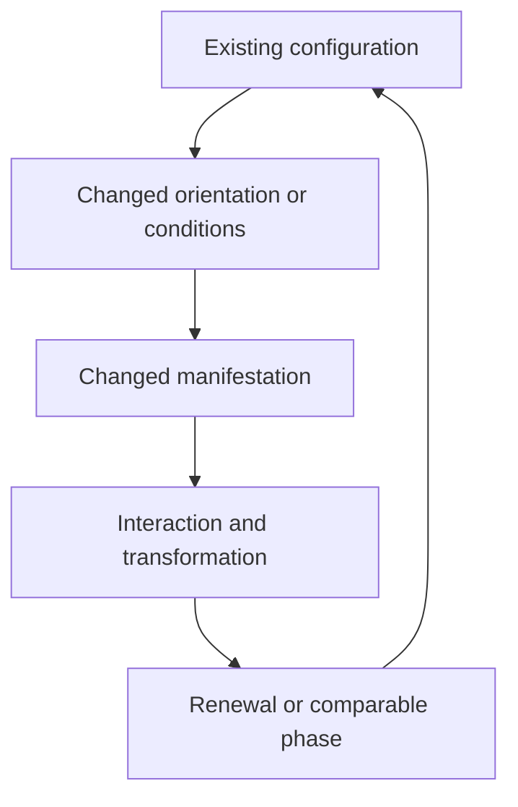

# Framework: relationships, cycles, and changing orientation

## 1. Purpose and scope

Adjacent Relativity, as developed in this discussion, asks whether a difficult relationship becomes clearer when examined through a different system with a corresponding relational structure. It extends the user's original teaching-oriented idea into an interpretive research method. Its immediate case study concerns Nahua lore; its broader examples concern physical cycles and human interactions.

There are three distinct uses:

1. **Communication:** an adjacent example makes a difficult relationship understandable.
2. **Interpretation:** a comparison suggests a possible reading of ambiguous material.
3. **Investigation:** a mapping generates expectations that can be checked against new evidence.

Success in communication does not automatically establish historical intent or explanatory truth. Calling the framework “relativity” does not identify it with Einstein's theories.

## 2. The unit of comparison

Compare what relates to what, under which conditions, at which level. For example, a preceding state producing a later state can be compared with a mythic father relation without asserting that the deity is literally a physical state.

An adjacent mapping should state:

- the target system and the comparison system;
- their components and typed relationships;
- which relationships correspond;
- the changes of scale or context involved;
- which properties do not correspond;
- what further observation would support or defeat the reading.

“Both involve change” is too general to distinguish an informative model from a loose resemblance.

## 3. Cycle, orientation, transformation

Brandon's organizing proposal combines three ideas:

**Cycle:** recurrence or return to a comparable phase.

**Orientation:** position relative to other components, a frame, an axis, or a context.

**Transformation:** a change of manifestation, function, condition, or outcome.

The working relation is:

> Same system + changed orientation or conditions → potentially changed manifestation or outcome.

“Potentially” matters: some reorientations are merely changes of description, while others physically alter interactions. Distinguish changing coordinates from changing the system. A change in orientation is not sufficient to explain every transformation.

This is a proposed interpretive model, not a diagram claimed to be copied from an Indigenous source.

## 4. Multiple scales

| Scale | Material discussed | Proposed question |
|---|---|---|
| Cosmic | Heavens, Suns, stellar manifestations | What establishes or renews an ordering? |
| Worldly | Fire, seasons, agriculture, reproduction, death | What generates, sustains, and transforms another process? |
| Ritual | Sacrifice, sacred bundles, New Fire | How is an ordering enacted or renewed? |
| Mythic or heroic | Mixcoatl, Chimalma, Ce Acatl Quetzalcoatl | Which identity and narrative level does a kinship statement concern? |
| Human or situational | Conversation, choices, conflict, framing | How can a small relational change alter what follows? |

A claimed correspondence between scales must be recorded explicitly. It must not be assumed simply because the same name appears in both.

## 5. Beginning, recurrence, and establishment

Brandon emphasized that recurring beginnings need not exhaust what a creation account describes. A narrative may describe the establishment of recurrence itself.

| Concept | Definition |
|---|---|
| Absolute origin | The system or recurrence mechanism comes into existence |
| Phase origin | A chosen or culturally marked start within a traversal |
| Regenerative boundary | One iteration's end contributes to the next iteration's start |
| Epistemic origin | The earliest point known or accessible to an observer |

For an initiated cycle:

`Establishment → B₁ → E₁ → B₂ → E₂ → …`

For a cyclic representation of phase:

`A → B → C → A → …`

These describe different information. Identifying equivalent phases discards iteration history. A ring-shaped state space alone cannot tell us whether a process had a first traversal.

**A cycle that continues indefinitely into the future can have an originating event. A process defined as eternal in both temporal directions has no first temporal event.** An origin may also be a logical or mythic foundation rather than an event in ordinary time. The earlier assistant response blurred these distinctions by treating “perpetual” and “beginningless” as interchangeable.

An observer's inability to distinguish a beginning is a limit of knowledge, not evidence that no origin exists. Conversely, observing a mature cycle does not uniquely recover its initiating conditions. Many histories can produce the same recurrence.

## 6. Kinship and identity

The following are candidate readings, not universal translations of Nahua kinship words:

| Relation | Proposed process reading | Additional possibilities to preserve |
|---|---|---|
| Father / mother | Generative or preceding condition | Narrative parentage, ancestry, patronage |
| Son / daughter | Resulting or succeeding manifestation | Narrative child, descent, belonging |
| Brother / sister | Parallel manifestations at a comparable level | Siblings, peer powers, local theological grouping |
| Twin / counterpart | Complementary outcomes or paired functions | Specific narrative or astronomical pairing |
| Aspect / name change | Same power under another condition or office | Local identification, epithet, ritual embodiment |
| Like the Father | Analogy to a generative role | A particular participant's interpretive distinction |

Kinship metaphors can help interpret a text, but literal narrative genealogy must remain available where supported. Different communities may preserve different accounts rather than fragments of one recoverable master system.

The proposal is to retain a variant relation first and investigate it. Cyclicity must not become an automatic explanation for every inconsistency. Genuine disagreement among accounts remains possible.

## 7. Typed network

Use six baseline relationship types: **union**, **stated parentage**, **creation/production**, **manifestation/name/aspect**, **counterpart**, and **transformation/succession**. Add specialized types such as protection, foster care, conflict, ritual association, and analogy as required. Do not represent all of these with one unlabeled arrow.

Layer tags inherited from the discussion:

| Tag | Layer |
|---|---|
| C | Cosmic |
| W | Worldly or natural |
| R | Ritual |
| G | Genealogical or mythic kinship |
| M | Metaphorical or processual interpretation |
| V | Variant tradition |

Primordial establishment and cyclical recurrence should be separate temporal-role fields. Cultural context and evidence status are separate again.

## 8. Minimal formalization

Represent a system as a typed directed multigraph `G = (V, E)`. More than one edge may connect the same nodes, because their relationship can differ across sources, layers, or episodes. An edge carries relation type, context, evidence, and provenance.

Let `f` map selected nodes of a target system into a comparison system. An informative mapping preserves specified relations: if `u —r→ v`, the mapped pair should exhibit a justified corresponding relation `f(u) —r′→ f(v)`. It need not preserve all relations or prove identity. This is a proposed formalization of the framework, not an established theorem.

Model recurrence as `x(n+1) = F(x(n), context(n))`. An exact periodic cycle requires return after some period; approximate recurrence permits resemblance without exact repetition. A mythic or ritual cycle should not be assumed to satisfy a physical dynamical equation.

Brandon's cycle proposal also distinguishes `Aₙ` from `Aₙ₊₁`: the same phase or identity class may recur while the historical instance differs. This can make generative and counterpart relations coexist in a model. It does not prove that a particular myth intended that model.
